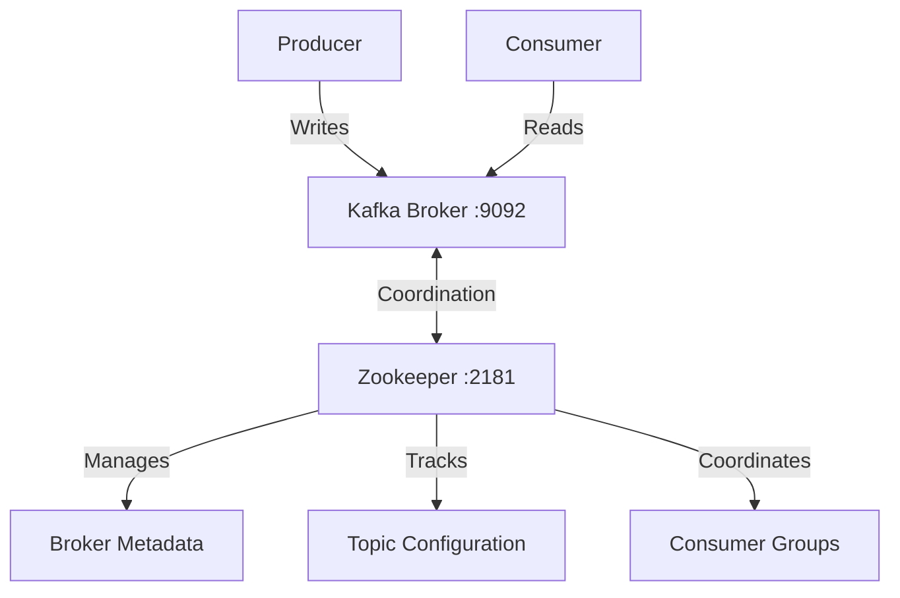

## Zookeeper

Zookeeper is a centralized service that maintains configuration information, provides distributed synchronization, and handles group services. In the context of Kafka, Zookeeper performs several critical functions:

1. **Broker Management**:
   - Keeps track of all Kafka brokers in the cluster
   - Maintains a list of active brokers
   - Notifies Kafka when a broker joins or leaves the cluster

2. **Topic Management**:
   - Maintains the list of topics
   - Number of partitions for each topic
   - Location of all partitions (which broker has which partitions)
   - Keeps track of the leader partition for each topic

3. **Consumer Group Coordination**:
   In our code, this is particularly relevant in these parts:
   ```go
   // From consumer/main.go
   group := "test-group"
   consumer, err := sarama.NewConsumerGroup(brokers, group, config)
   ```
   Zookeeper helps:
   - Manage consumer groups
   - Track which consumer is reading from which partition
   - Handle consumer group rebalancing when consumers join/leave

4. **Configuration Management**:
   ```go
   // From our Docker setup
   -e KAFKA_ZOOKEEPER_CONNECT=zookeeper:2181
   ```
   This tells Kafka where to find Zookeeper for:
   - Storing configurations
   - Coordinating between different Kafka nodes
   - Managing access control lists (ACLs)

5. **Leader Election**:
   - When a broker fails, Zookeeper helps elect new leaders for partitions
   - Ensures high availability and fault tolerance
   - Maintains the health of the Kafka cluster

Here's a simple diagram showing how Zookeeper fits in our setup:



In our Docker setup:
```bash
# Start Zookeeper first
docker run -d --name zookeeper --network kafka-network -p 2181:2181 wurstmeister/zookeeper

# Then start Kafka, pointing to Zookeeper
docker run -d --name kafka --network kafka-network \
  -e KAFKA_ZOOKEEPER_CONNECT=zookeeper:2181 \  # Connect to Zookeeper
  ...
```

This sequence is important because:
1. Zookeeper must start first
2. Kafka connects to Zookeeper during startup
3. Zookeeper then helps Kafka manage its operations

Without Zookeeper:
- Kafka wouldn't know which brokers are available
- Couldn't manage topic partitions
- Wouldn't be able to handle consumer group coordination
- Would lose its distributed system capabilities

In newer versions of Kafka (2.8+), there's a move towards removing the Zookeeper dependency (called KRaft mode), but for our example and most current production systems, Zookeeper is still a crucial component of the Kafka architecture.
